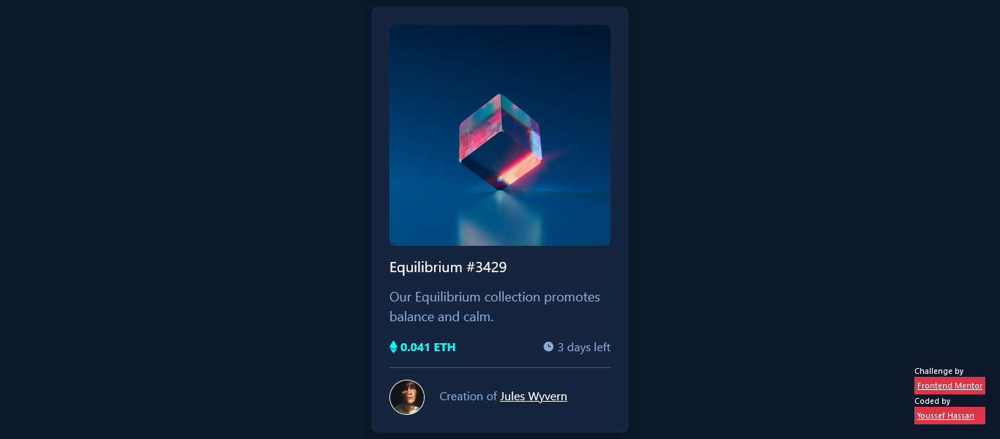

# Frontend Mentor - NFT preview card component solution

This is a solution to the [NFT preview card component challenge on Frontend Mentor](https://www.frontendmentor.io/challenges/nft-preview-card-component-SbdUL_w0U).

## Table of contents

- [Overview](#overview)
  - [The challenge](#the-challenge)
  - [Screenshot](#screenshot)
  - [Links](#links)
- [My process](#my-process)
  - [Built with](#built-with)
  - [What I learned](#what-i-learned)
  - [Continued development](#continued-development)
  - [Useful resources](#useful-resources)
- [Author](#author)
- [Acknowledgments](#acknowledgments)

<!-- **Note: Delete this note and update the table of contents based on what sections you keep.** -->

## Overview

### The challenge

Users should be able to:

- View the optimal layout depending on their device's screen size
- See hover states for interactive elements

### Screenshot



### Links

- Solution URL: [Add solution URL here](https://your-solution-url.com)
- Live Site URL: [Add live site URL here](https://your-live-site-url.com)

## My process

- just working on it in spare time.

### Built with

- Semantic HTML5 markup
- CSS custom properties
- Flexbox
- CSS Grid
- Mobile-first workflow
- [Bootstrap](https://getbootstrap.com/) - CSS & JS library

### What I learned

- simply improving my knowledge about using Bootstrap 5 and memorizing the css selectors and html inline styling.

```html

```

```css
.card > div > img {
      box-shadow: rgba(0, 0, 0, 0.25) 0px 5px 15px;
    }

.effect:hover > .svg_icn {
      display: flex;
    }
```

### Useful resources

- [Bootstrap Documentation](https://getbootstrap.com/docs/5.1/getting-started/introduction/) - This helped me for using the main classes.

## Author

- Website - [COMING SOON](#COMINGSOON)
- [Frontend Mentor](https://www.frontendmentor.io/profile/Joe-Hsn)
- [Twitter](https://www.twitter.com/Jo_Hsn)
- [Telegram](https://t.me/Joe_Hsn)
